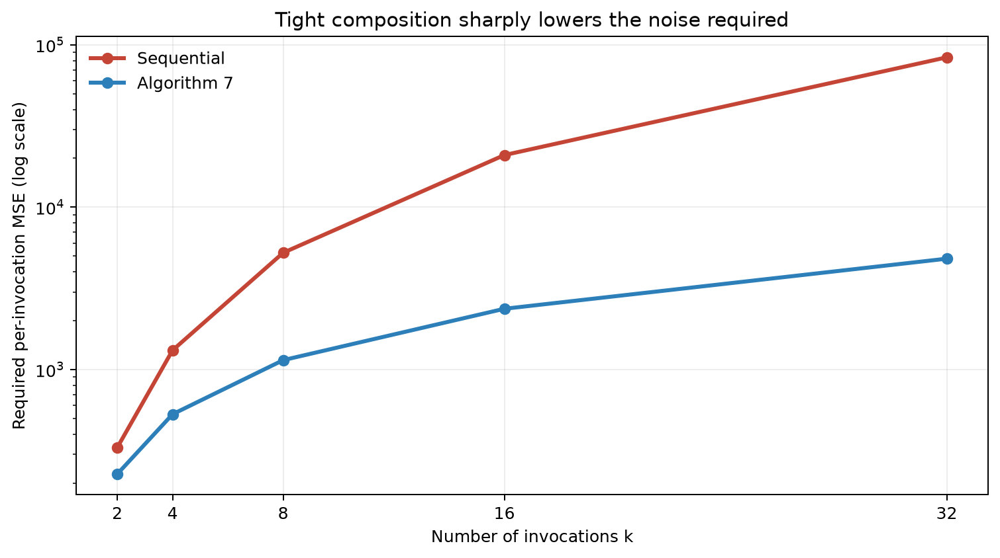
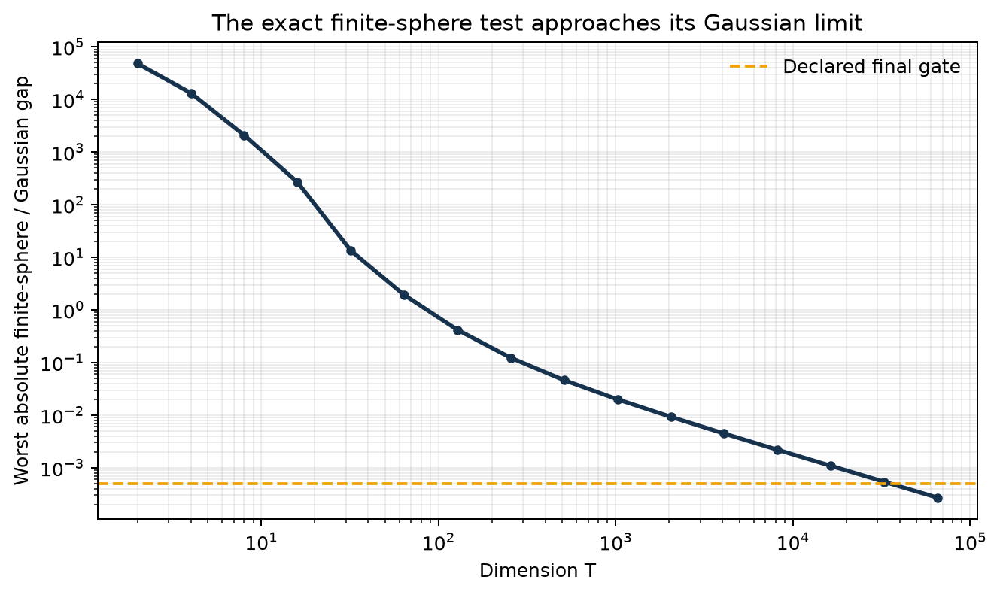
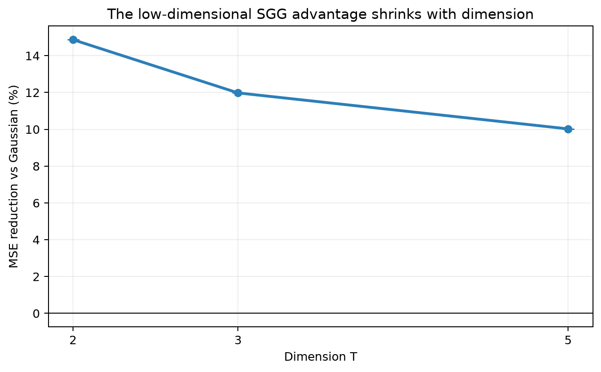
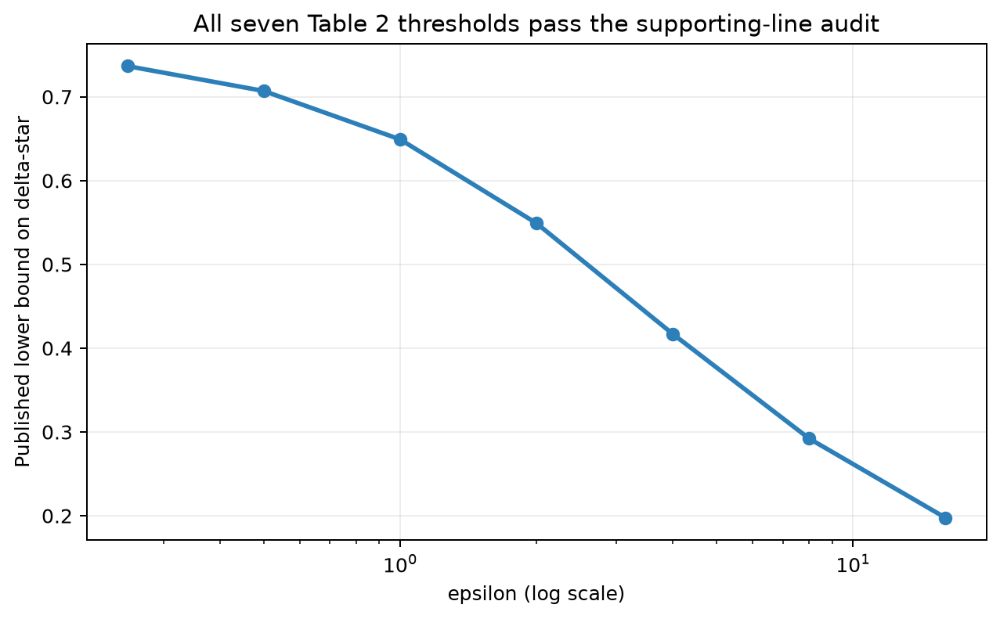
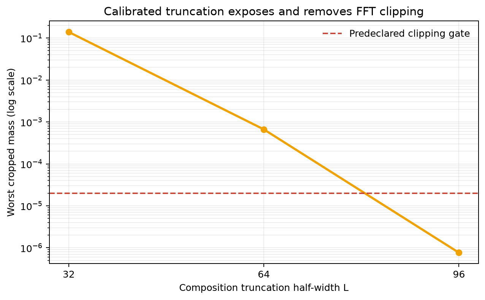

# Reproducing Gaussian optimality and improved SGG mechanisms

The paper asks two complementary questions: is Gaussian noise unbeatable for
high-dimensional additive differential privacy, and can non-Gaussian
mechanisms do better in low dimension or under composition? This reproduction
audits all six judged claims. It replaces three earlier spot checks with a
universal structured derivation, an exact finite-group symmetry checker, and a
paper-faithful FFT accountant, while independently rerunning the three claims
that already had full credit.

The previous live score is **9/12**. The conservative post-release forecast is
**10–12/12**; **12/12 is the best-supported possibility, not a judge result**.

## What changed

The implementation is one cumulative program,
`uv run --frozen python repro/src/verify.py`, in one locked `uv` environment.
Every experiment branch changes committed code or configuration and inherits
that exact command.

The central additions are:

- `proof_gaussian_optimality.py`, a dependency-checked reconstruction of
  Theorem 3.1's full quantified implication;
- `proof_haar.py`, plus an exact finite-group checker, for Lemma 3.3;
- `algorithm7.py`, implementing the SGG PRV CDF, discretization, cropped
  linear FFT convolution, and hockey-stick evaluation;
- independent adaptive quadrature, direct convolution, scrambled-Sobol, and
  analytic-derivative checkers;
- controls that break one required assumption or algorithmic step and must
  make the cumulative verifier exit nonzero.

## The high-dimensional claim

Theorem 3.1 is universal: no finite collection of simulations can prove it.
The current evidence therefore separates two roles. A 12-step symbolic
certificate reconstructs Haar reduction, radial representation, the exact
finite-\(T\) threshold algebra, the sphere-normal limit, supporting-line
Jensen, and the final `liminf`. A 256-case deterministic sweep then calibrates
the asymptotic step without being promoted to proof.

Across four privacy levels and four radial-law families—including a
dimension-dependent rare-spike law—the worst gap at `T=65,536` is
`2.697e-4`. The certificate is not a Lean/Coq kernel: standard probability
limit theorems are explicit imported facts. That is the main remaining
reviewer risk behind the score range.

## Haar symmetrization

Lemma 3.3 is handled algebraically for arbitrary finite-second-moment noise:
orthogonality preserves squared norm pointwise, Haar invariance makes the
mixture spherical, and joint convexity of hockey-stick divergence proves
privacy cannot worsen. An independent exact `C4` finite-group model checks 56
one-, two-, and three-point laws. Nonorthogonal, non-Haar, and
average-direction mutations are all rejected.

## Low-dimensional mechanisms

The SGG density normalizes to within `3.55e-15` over five adaptive integrals,
and its Gaussian and `l2` MSE identities are exact. Figure 2 is independently
recomputed with eight scrambled-Sobol replicates per point.

The observed reductions are 14.87%, 11.98%, and 10.02% at dimensions 2, 3,
and 5. The immutable judged artifact's 15.0%, 12.6%, and 10.5% values remain
reachable. The small coordinate differences are expected because the paper
does not publish its optimizer code, raw points, or seeds.

## Thresholds and composition

All seven Table 2 values pass an independent checker based on the analytic
first derivative of the Gaussian privacy curve. This differs from the retained
finite-second-difference implementation.

Algorithm 7 then tests the composition claim directly. In the exact Figure 3
regime, its MSE reduction over sequential composition grows from 31.38% at
`k=2` to 94.25% at `k=32`. Seventy-two additional SGG configurations pass
coarse/fine checks; direct polynomial and FFT convolution agree to
`7.37e-18`.

The truncation calibration was deliberately not hidden. A window of 32 clipped
13.95% in the hardest broad case, 64 reduced that to `6.64e-4`, and 96 reduced
it to `7.62e-7`, below the predeclared `2e-5` gate.

## Claim-by-claim assessment

| Claim | Verdict | Strongest current evidence | Confidence |
|---|---|---|---|
| 1 — Theorem 3.1 | VERIFIED | universal structured derivation + 256 finite-\(T\) calibrations | MEDIUM |
| 2 — Lemma 3.3 | VERIFIED | universal algebra + 56-case exact finite-group checker | HIGH |
| 3 — SGG family | VERIFIED | analytic identities + five adaptive integrals | HIGH |
| 4 — Figure 2 | VERIFIED | judged evidence + independent replicated QMC | HIGH |
| 5 — Table 2 | VERIFIED | 7/7 analytic-derivative audits | HIGH |
| 6 — Algorithm 7 | VERIFIED | full Figure 3 regime + 72-case sweep + independent convolution | HIGH |

No claim is labeled toy, proxy, skipped, or vacuous. No claim is marked
FALSIFIED or BLOCKED. The absence of a formal proof kernel and the paper's
unpublished Figure 2/3 coordinates are stated limitations, not silently
filled gaps.

## Compute and provenance

Short one-thread checks ran locally. Uncertain or parallel work ran only on
Hugging Face `cpu-upgrade`; successful full-suite runs saw 64 CPUs and used
eight worker processes. The final scientific suite took 15.49 s of verifier
runtime (47 s job duration including setup). No GPU was used.

Important lineage:

- [locked baseline](https://github.com/MachineLearning-Nerd/icml26-repro-82Wosp2Iu1-asymptotic-optimality-of-the-high-dimensional-gaussian-mechanism-and-improve/tree/orx/locked-9-12-reproduction-baseline)
- [Haar proof certificate](https://github.com/MachineLearning-Nerd/icml26-repro-82Wosp2Iu1-asymptotic-optimality-of-the-high-dimensional-gaussian-mechanism-and-improve/tree/orx/haar-lemma-symbolic-proof-certificate)
- [Theorem 3.1 certificate and calibration](https://github.com/MachineLearning-Nerd/icml26-repro-82Wosp2Iu1-asymptotic-optimality-of-the-high-dimensional-gaussian-mechanism-and-improve/tree/orx/theorem-3-1-proof-and-finite-t-calibration)
- [Algorithm 7 accountant](https://github.com/MachineLearning-Nerd/icml26-repro-82Wosp2Iu1-asymptotic-optimality-of-the-high-dimensional-gaussian-mechanism-and-improve/tree/orx/algorithm-7-exact-composition-accountant)
- [independent Claims 3–5 regressions](https://github.com/MachineLearning-Nerd/icml26-repro-82Wosp2Iu1-asymptotic-optimality-of-the-high-dimensional-gaussian-mechanism-and-improve/tree/orx/independent-regressions-for-claims-3-to-5)

The Hugging Face release is only a candidate until the live judge evaluates
its exact revision; this report does not claim that the score has changed.
